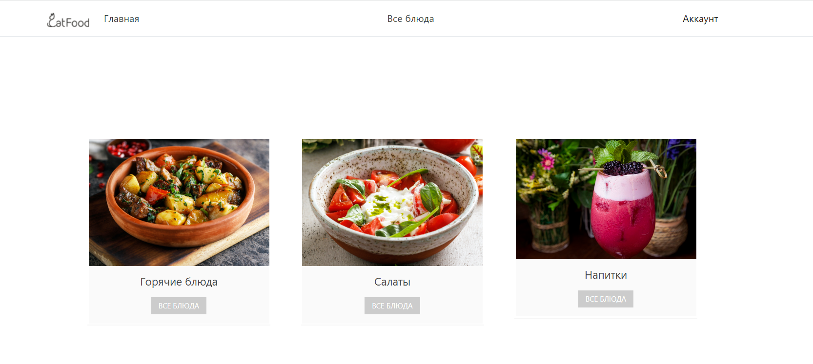

# README

Welcome to the Cafe repository!

## Project Description

This project is a web application for a cafe, developed using ASP.NET technology and the MVC architecture. The project includes features for efficient order management, menu customization and general cafe operations.

## Technologies

- ASP.NET MVC
- Entity Framework
- HTML/CSS
- JavaScript

## Installation Instructions

0. Clone the repository to your local machine:

   ```bash
   git clone https://github.com/StaarLing/ASP.NET_Cafe.git

1. **Open the project in Visual Studio (or another IDE) and ensure that you have the necessary dependencies installed.**

2. **Run the project and verify that it compiles and launches successfully.**

3. **Configure the database if necessary, using Entity Framework migration files.**

4. **Set up the database connection in the `appsettings.json` file.**

5. **Customize view, controller, and model files according to your cafe's requirements.**

## Screenshots


---

Thank you for visiting our repository! We appreciate your contributions and feedback. Happy coding!